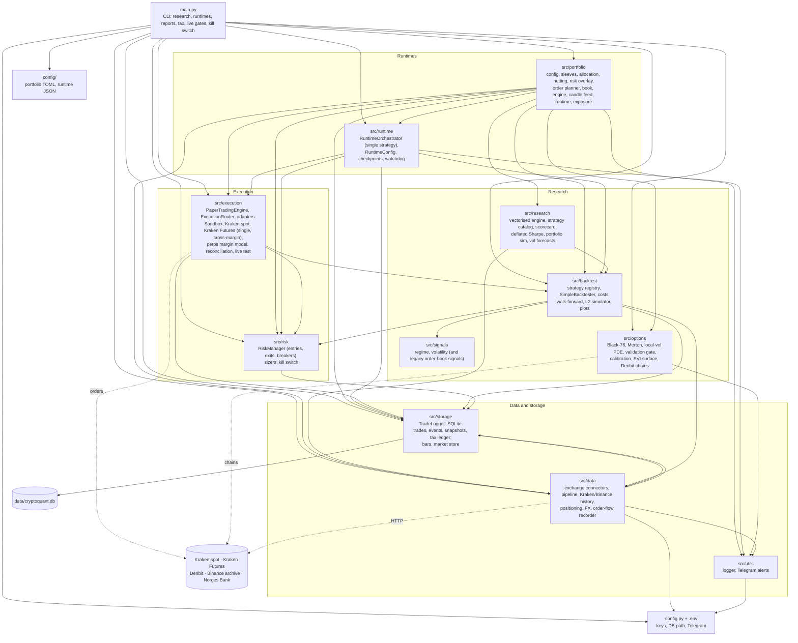

# CryptoQuantMFT

A Python 3.13 framework for systematic crypto trading on Kraken, covering spot and Kraken Futures perpetuals. It
takes a strategy from research to paper to live: a multi-strategy portfolio, Norwegian tax records, and an options
research track. **Paper mode is the source of truth**, and real trading sits behind explicit gates.

## Status (2026-09-26)

| Area | State |
| --- | --- |
| Research, backtests, notebooks | Safe any time (public data) |
| Paper portfolio (`--portfolio`) | Runs until stopped, with checkpoints, a dashboard and Telegram alerts |
| Kraken Futures live | Proven with a real minimum-size round trip; `config/portfolio.btc_live.toml` is ready behind the live gates |
| Kraken spot live (single-strategy runtime) | Proven with small round trips; the last hardening items are in `todo_important.md` |
| Options | Research only (pricing, calibration, SVI surface, exposures); no execution |

The roadmap is in [`TODO.MD`](TODO.MD), live-execution hardening in [`todo_important.md`](todo_important.md), and
the long-term direction (what an industry-level setup needs) in [`aspirations.md`](aspirations.md).

## Setup

```bash
conda env create -f environment.yml && conda activate CryptoArb
pytest                                   # ~600 tests, under a minute
```

Credentials go in `.env` (never commit it; keys need no withdrawal permission): `KRAKEN_API_KEY`, `KRAKEN_SECRET`,
`KRAKEN_FUTURES_API_KEY`, `KRAKEN_FUTURES_SECRET`, `TELEGRAM_BOT_TOKEN`, `TELEGRAM_CHAT_ID`. `config.py` loads them.

## Everyday commands

```bash
# Research
python scripts/research/portfolio_backtest.py config/portfolio.example.toml    # sleeves, books, holdout
python scripts/research/risk_budget.py config/portfolio.btc_live.toml --capital 19 --max-drawdown 0.3
python scripts/research/stop_study.py config/portfolio.btc_live.toml          # do the risk exits help?
# notebooks/signal_research.ipynb (open in VS Code or Jupyter): try and score a new signal

# Portfolio: check, paper, dashboard
python main.py --portfolio-check config/portfolio.btc_live.toml
python main.py --runtime paper --portfolio config/portfolio.btc_live.toml --runtime-iterations 0 --runtime-interval 60
python main.py --dashboard --report

# Read-only exchange checks (no orders)
python main.py --kraken-verify-dry-run --kraken-verify-symbol BTC/EUR
python main.py --telegram-test
python main.py --option-chain-snapshot

# Tax
python main.py --tax-report --tax-year 2026 --tax-export-path exports/tax_2026.csv
```

**Real orders:** `--runtime live`, `--futures-live-test`, the `--kraken-submit-*` / `--kraken-close-*` flows and
`--kill-switch` act on the real account. `--kill-switch` works without a runtime running: it cancels every open
Kraken order and closes every Kraken Futures position (spot coins are kept); `--kill-switch-reset` re-arms it. Live needs `--enable-live-trading --live-confirmation
ENABLE_LIVE_TRADING`, a named `--execution-exchange`, a ready kill switch and, for the portfolio,
`[risk] max_gross_notional`. See [`docs/runbook.md`](docs/runbook.md) before using any of them.

## Module map

Arrows read "uses" (they follow the imports). `main.py` is the only entry point, and each flag calls one function
in it.



Notebooks (`notebooks/`) and scripts (`scripts/research/`) sit on top of `src/research`, `src/portfolio` and
`src/options`. They never place orders.

### The two runtime paths

- **Portfolio (the main path):** `CandleFeed` (REST candles) → each sleeve's strategy and exits → allocation →
  netting per instrument → risk overlay (caps, money cap, drawdown kill) → order planner (lots, bands,
  reduce-only) → adapter (paper sandbox or Kraken Futures) → `PortfolioBook` → `TradeLogger` and Telegram. The
  research backtester runs the same functions, and a parity test holds research and runtime to the same result.
- **Single strategy (spot, the older path):** connector → `MarketDataPipeline` → bars → strategy →
  `RiskManager` → `PaperTradingEngine` → `ExecutionRouter` → adapter → reconciliation → `TradeLogger`.

A new strategy is registered once, in `StrategyRegistry` (`src/backtest/runner.py`), with its defaults and sweep
grid in `src/research/catalog.py`. It is then available to the notebooks, the research scripts, portfolio sleeves
and the runtime.

## Conventions

`Decimal` for money, balances and order sizes; log returns for statistics. Async, non-blocking network code. Fees
and slippage in every backtest; no look-ahead. SQLite is the record: reports, the dashboard and tax read from it.
Orders go through the adapters, never directly from a strategy. More in [`CLAUDE.md`](CLAUDE.md).

## Docs

| File | What |
| --- | --- |
| [`docs/runbook.md`](docs/runbook.md) | How to run everything, the live checklists, the kill switch, backups |
| [`docs/architecture-map.md`](docs/architecture-map.md) | The code in more detail, class by class |
| [`docs/portfolio_plan.md`](docs/portfolio_plan.md) | The portfolio design and build phases |
| [`docs/options_plan.md`](docs/options_plan.md) | Options: pricing models, the test gate, strategy design notes |
| [`docs/research_log.md`](docs/research_log.md) | Every study and what it found, newest first |
| [`docs/research_guide.md`](docs/research_guide.md) | How to research a strategy without fooling yourself |
| [`docs/perpetual_futures.md`](docs/perpetual_futures.md) | Perps: contracts, margin, funding, Kraken specifics |
