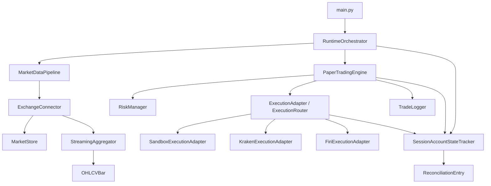

# CryptoQuantMFT architecture map

This file is a practical map of how the codebase is wired today. It shows the main layers, the key classes, and the way they interact.

## 1. What the system does now

The project is no longer just a simple backtest toy. It now has a layered flow that can:

- ingest market data from mock or real exchange connectors,
- aggregate that data into OHLCV bars,
- generate signals from those bars,
- apply risk controls before entering trades,
- route orders through paper or execution-adapter paths,
- persist trades, equity snapshots, and operational events,
- and report runtime health and reconciliation state.

That makes it much closer to a real paper-trading / near-live trading setup.

## 2. The high-level flow

## 3. File-by-file map

### Entry point

- `main.py`
  - Main CLI entry point.
  - Builds the runtime stack, runs the orchestrator, and logs health/status output.
  - Connects the pieces together for backtests, paper runs, and runtime experiments.

### Market data layer

- `src/data/exchanges.py`
  - Defines `ExchangeConnector` and concrete connectors:
    - `MockExchangeConnector`
    - `KrakenConnector`
    - `FiriConnector`
  - These fetch market snapshots, persist ticks into the market store, and feed the streaming aggregator.

- `src/data/pipeline.py`
  - `MarketDataPipeline` orchestrates connectors and the shared aggregator/store.
  - `run_once()` asks each connector for a snapshot and `flush_bars()` returns completed OHLCV bars.

### Storage layer

- `src/storage/market_store.py`
  - `MarketStore` saves normalized ticks to SQLite and parquet.
  - Acts as a durable record of market data.

- `src/storage/streaming_aggregator.py`
  - `StreamingAggregator` converts incoming ticks into rolling OHLCV bars.
  - This is the bridge between raw market snapshots and strategy/risk processing.

- `src/storage/bar_aggregator.py`
  - Defines the `OHLCVBar` data shape used by the strategy and risk logic.

- `src/storage/trade_logger.py`
  - `TradeLogger` persists:
    - trades,
    - equity snapshots,
    - operational events.
  - This is the operational audit trail for paper/live-like runs.

### Strategy and risk layer

- `src/backtest/simple_backtest.py`
  - Contains the default strategy function (`moving_average_crossover_strategy`).
  - Produces signals from a sequence of bars.

- `src/risk/controls.py`
  - `RiskManager` and `RiskControlConfig` gate entries and size decisions.
  - They limit overtrading and make the runtime safer by enforcing drawdown, volatility, spread/slippage, and position caps.

### Execution layer

- `src/execution/adapters.py`
  - Core execution abstraction.
  - Classes include:
    - `ExecutionAdapter` (base interface)
    - `SandboxExecutionAdapter` (safe in-process simulation)
    - `ExchangeExecutionAdapter` (base for live-style adapters)
    - `KrakenExecutionAdapter`
    - `FiriExecutionAdapter`
    - `ExecutionRouter`
  - This is where order placement, order state, and basic reconciliation live.

- `src/execution/paper_trading.py`
  - `PaperTradingEngine` is the engine that turns signals into orders and fills.
  - It uses the execution adapter when present, otherwise it behaves as a pure paper engine.
  - It also updates portfolio state and writes trades/equity snapshots.

- `src/execution/reconciliation.py`
  - `SessionAccountStateTracker` and `ReconciliationEntry` track:
    - balances,
    - positions,
    - unsettled orders,
    - reconciliation mismatches.
  - This is the new layer that makes runtime state look more like a real session.

### Runtime / orchestration layer

- `src/runtime/orchestrator.py`
  - `RuntimeOrchestrator` ties everything together for a loop.
  - It runs startup checks, collects market data, builds signals, runs the paper trading engine, and records runtime health.
  - It now also updates the account-state tracker and exposes a health report with reconciliation data.

## 4. How the pieces actually work together

### A. Market data -> bars -> signals

1. `main.py` builds the runtime stack.
2. `MarketDataPipeline` attaches one or more connectors.
3. Each connector fetches a market snapshot and pushes it into the shared `MarketStore` and `StreamingAggregator`.
4. The aggregator emits OHLCV bars.
5. `RuntimeOrchestrator` passes those bars into the strategy function.
6. The strategy returns a buy/sell/hold signal.

### B. Signals -> risk gate -> execution

1. `RuntimeOrchestrator` hands the bars and signals to `PaperTradingEngine`.
2. `PaperTradingEngine` evaluates the signal.
3. `RiskManager` decides whether the signal is allowed to enter and how large the position should be.
4. If allowed, `PaperTradingEngine` creates an order and asks the execution adapter to submit it.

### C. Orders -> adapter -> account state

1. `ExecutionRouter` decides which adapter should be used.
2. The adapter records the order locally and, for sandbox/exchange-style paths, keeps a view of balances/positions.
3. `SessionAccountStateTracker` compares local order state to whatever the adapter reports.
4. Reconciliations are stored and surfaced in the runtime health report.

### D. Execution -> persistence -> observability

1. Filled orders produce trades and portfolio updates.
2. Those are persisted by `TradeLogger`.
3. The runtime also logs operational events and health status.
4. This gives you a more realistic paper-trading loop with an audit trail.

## 5. Why this matters

The codebase now has a useful safety and realism stack:

- risk controls limit bad entries,
- execution routing makes it possible to test safely before live use,
- reconciliation tracking makes local state closer to exchange/account reality,
- and runtime health reporting helps you see whether the system is behaving as expected.

What this improves:

- safer experimentation,
- more realistic paper-trading behavior,
- easier debugging,
- better operational visibility.

What this still limits:

- live execution is still intentionally conservative and not fully production-hardened,
- exchange adapters are still more of a structured integration scaffold than a mature broker stack,
- reconciliation is useful but not yet a complete recovery/replay system.

## 6. Mental model

Think of the repo as a small trading runtime with four core layers:

- Data ingestion: connectors + store + aggregator
- Decision layer: signal generation + risk controls
- Execution layer: paper engine + adapters + reconciliation
- Operational layer: logging + health reporting

The system is strongest when all four layers are present together. If one layer is missing, the runtime becomes less realistic and less trustworthy.
