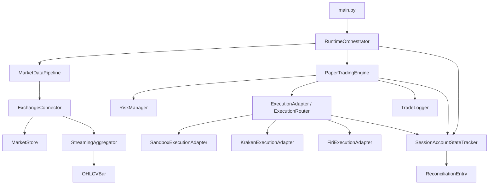

# CryptoQuantMFT architecture map

This file is a practical map of how the codebase is wired today. It shows the main layers, the key classes, and the way they interact.

## 1. What the system does now

The project is no longer just a simple backtest toy. It now has a layered flow that can:

- ingest market data from mock or real exchange connectors,
- aggregate that data into OHLCV bars,
- generate signals from those bars,
- apply risk controls before entering trades,
- route orders through paper or execution-adapter paths,
- persist trades, equity snapshots, and operational events,
- and report runtime health and reconciliation state.

That makes it much closer to a real paper-trading / near-live trading setup.

## 2. The high-level flow

```mermaid
flowchart TD
    A[main.py] --> B[RuntimeOrchestrator]
    B --> C[MarketDataPipeline]
    C --> D[ExchangeConnector]
    D --> E[MarketStore]
    D --> F[StreamingAggregator]
    F --> G[OHLCVBar]
    B --> H[PaperTradingEngine]
    H --> I[RiskManager]
    H --> J[ExecutionAdapter / ExecutionRouter]
    J --> K[SandboxExecutionAdapter]
    J --> L[KrakenExecutionAdapter]
    J --> M[FiriExecutionAdapter]
    H --> N[TradeLogger]
    B --> O[SessionAccountStateTracker]
    O --> P[ReconciliationEntry]
    J --> O
    H --> O
```

## 3. File-by-file map

### Entry point

- `main.py`
  - Main CLI entry point.
  - Builds the runtime stack, runs the orchestrator, and logs health/status output.
  - Connects the pieces together for backtests, paper runs, and runtime experiments.

### Market data layer

- `src/data/exchanges.py`
  - Defines `ExchangeConnector` and concrete connectors:
    - `MockExchangeConnector`
    - `KrakenConnector`
    - `FiriConnector`
  - These fetch market snapshots, persist ticks into the market store, and feed the streaming aggregator.

- `src/data/pipeline.py`
  - `MarketDataPipeline` orchestrates connectors and the shared aggregator/store.
  - `run_once()` asks each connector for a snapshot and `flush_bars()` returns completed OHLCV bars.

- `src/data/recorder.py` (`main.py --record-market-data`, `--market-data-status`)
  - A standalone async recorder of public WebSocket data: Kraken Futures and spot trades, checked order books
    sampled every second, perp tickers, and Binance/Bybit liquidations. It writes daily CSV files, compacted to
    Parquet, under `data/market_data/`.
  - `load_market_data()` and `recording_gaps()` read them back for research. The recorder is not part of the
    trading runtime and shares nothing with it.

- `src/data/kraken_spreads.py` (`scripts/collectors/kraken_spreads.py`, `scripts/research/kraken_costs.py`):
  Kraken Futures' real spreads and book depth, recorded over time and compared with a config's assumed slippage;
  `TouchQuotes` gives the paper exchange the real best bid and ask for resting maker orders.
- `src/data/positioning.py`
  - Public funding, open-interest, long/short-ratio and implied-vol history from Binance, Bybit and Deribit for
    research, cached under `data/historical_cache/positioning/`.

- `src/data/binance_archive.py`
  - Daily bars, funding and perp premium for every Binance USDT perpetual (delisted included) from
    data.binance.vision, cached per symbol under `data/historical_cache/binance_um/`. Research only; the
    multi-coin portfolio backtester is `src/research/portfolio.py`.

### Storage layer

- `src/storage/market_store.py`
  - `MarketStore` saves normalized ticks to SQLite and parquet.
  - Acts as a durable record of market data.

- `src/storage/streaming_aggregator.py`
  - `StreamingAggregator` converts incoming ticks into rolling OHLCV bars.
  - This is the bridge between raw market snapshots and strategy/risk processing.

- `src/storage/bar_aggregator.py`
  - Defines the `OHLCVBar` data shape used by the strategy and risk logic.

- `src/storage/trade_logger.py`
  - `TradeLogger` persists:
    - trades,
    - equity snapshots,
    - operational events.
  - This is the operational audit trail for paper/live-like runs.

### Strategy and risk layer

- `src/backtest/strategies.py`
  - Every strategy factory (`moving_average_crossover_strategy` is the default), plus `latch_position` for entry/exit rules and the `make_long_only` / `make_regime_gated` wrappers.
  - Each factory returns a function that produces a signal from a sequence of bars; `StrategyRegistry` in `src/backtest/runner.py` maps runtime `--strategy` names to them.
  - Indicators for strategies live in `src/backtest/indicators.py`.
- `src/backtest/simple_backtest.py`
  - The backtest engine (`SimpleBacktester`), which also reports mark-to-market equity and position series per bar.
- `src/research/` and `scripts/research/research.py`
  - Offline strategy research (catalog of hypotheses and sweep grids, in-sample/holdout evaluation, parameter sweeps, heatmaps). Not used by the runtime. See `docs/research_guide.md`.

- `src/risk/controls.py`
  - `RiskManager` and `RiskControlConfig` gate entries and size decisions.
  - They limit overtrading and make the runtime safer by enforcing drawdown, volatility, spread/slippage, and position caps.
- `src/risk/sizing.py`
  - Pluggable entry sizing (`fixed_fraction`, `fixed_notional`, `vol_target`, `atr_risk`, `kelly`), built by name with
    `build_sizer`. Every sizer returns a share of equity.
  - `RiskManager` builds the one named in `RiskControlConfig.sizing` / `sizing_params`, caps its answer, and returns
    it as `RiskDecision.position_size` / `equity_fraction`.
  - `PaperTradingEngine._resolve_order_size` is the only place a share becomes units. The engine reports closed
    round trips to `RiskManager.record_trade_return` for the Kelly sizer.

### Execution layer

- `src/execution/adapters.py`
  - Core execution abstraction.
  - Classes include:
    - `ExecutionAdapter` (base interface)
    - `SandboxExecutionAdapter` (safe in-process simulation)
    - `ExchangeExecutionAdapter` (base for live-style adapters)
    - `KrakenExecutionAdapter`
    - `FiriExecutionAdapter`
    - `ExecutionRouter`
  - This is where order placement, order state, and basic reconciliation live.

- `src/execution/perps.py`
  - Perpetual-futures contract spec, margin math and `SandboxPerpExecutionAdapter` (margin account with funding and liquidation). Selected with `--execution-exchange kraken_futures`: the sandbox in `live_dry_run`, and `src/execution/kraken_futures_adapter.py` (real signed Kraken Futures orders) in `live`. See `docs/perpetual_futures.md`.

- `src/execution/paper_trading.py`
  - `PaperTradingEngine` is the engine that turns signals into orders and fills.
  - It uses the execution adapter when present, otherwise it behaves as a pure paper engine.
  - It also updates portfolio state and writes trades/equity snapshots.

- `src/execution/emergency.py` and `src/risk/kill_switch.py`
  - `KillSwitchController` keeps the state file (`data/kill_switch_state.json`, written atomically and re-read on
    every check, so an activation from another terminal reaches running runtimes).
  - `python main.py --kill-switch` (`kill_switch()` in `main.py`) doesn't need a runtime: it writes the state, cancels
    every Kraken spot order (recovered from Kraken, then `CancelAll`), and `flatten_kraken_futures` cancels every
    futures order and closes every position reduce-only, recording the closes in the trade log and tax ledger.
    `--kill-switch-reset` re-arms it.

- `src/execution/reconciliation.py`
  - `SessionAccountStateTracker` and `ReconciliationEntry` track:
    - balances,
    - positions,
    - unsettled orders,
    - reconciliation mismatches.
  - This is the new layer that makes runtime state look more like a real session.

### Runtime / orchestration layer

- `src/runtime/orchestrator.py`
  - `RuntimeOrchestrator` ties everything together for a loop.
  - It runs startup checks, collects market data, builds signals, runs the paper trading engine, and records runtime health.
  - It now also updates the account-state tracker and exposes a health report with reconciliation data.

### Portfolio layer (several strategies and instruments; `main.py --runtime paper --portfolio PATH`)

Plan and status: `docs/portfolio_plan.md`.

- `src/portfolio/config.py`: the TOML portfolio config and its validation (`main.py --portfolio-check`).
- `src/portfolio/sleeves.py`: one strategy on one instrument, turned into a target weight bar by bar.
- `src/portfolio/basket.py`: basket sleeves (`[[baskets]]`): one cross-sectional strategy that sets the weights of
  many member sleeves (`<basket>__<coin>`) on a calendar rebalance schedule, from Binance daily candles (archive for
  research, public REST in the runtime via `CachedPanelSource`). The engine steps them in `_step_baskets`;
  allocation counts a basket as one sleeve (`PortfolioConfig.allocation_groups`).
- `src/portfolio/allocation.py`, `netting.py`, `risk.py`, `orders.py`: the pure core. It allocates sleeves, nets
  them per instrument, applies the portfolio risk limits, and plans the orders.
- `src/portfolio/risk_model.py`: the book's risk model. `RiskModel` is an EWMA covariance of instrument returns
  stepped once per grid bar (shrunk correlations, a stressed version with correlations floored for crashes, JSON
  checkpoint); `RiskEstimate` answers what a set of weights amounts to (volatility, beta to a benchmark, risk
  shares, diversification ratio); `ReturnWindow` keeps the strategies' recent returns for their correlations and
  effective number of bets.
- `src/portfolio/book_risk.py`: `exposure_summary` (long/short, gross/net per group, venue and coin, beta,
  volatility, VaR, risk shares; stored in every snapshot and printed by the dashboard and the research script),
  `build_risk_model` from a config, and `estimate_stream` / `exposure_history`, which replay the model over a
  backtest bar by bar as the runtime steps it. The overlay in `risk.py` reads the estimate for its group, beta and
  volatility caps (`[risk.groups]`, `max_beta_exposure`, `max_portfolio_vol`) and enforces `[risk.exposure]`
  `max_delta` and `max_scenario_loss` on linear targets.
- `src/research/signal_lab.py` plus `notebooks/signal_lab.ipynb`: candidate signals as comparable daily return
  series (carry, momentum, taker, liquidation proxy, variance premium) and a book of the ones chosen in-sample or
  of a preset. A showcase of known studies, not a route into a config.
- `src/portfolio/paper_check.py` plus `scripts/research/paper_vs_backtest.py`: a running book against the backtest
  over the same days (positions per decision bar, return since the first one), started at the book's first bar.
- `src/dashboard/`: the local read-only web dashboard. `data.py` turns the database and state folders into JSON
  (books, one book's latest snapshot, its history, fills, alerts, job health, measured costs); `server.py` serves
  it with aiohttp on 127.0.0.1 (GET only); `static/` is one React page without a build step.
- `src/portfolio/tearsheet.py`: one static HTML page per book (matplotlib charts embedded), from a research
  backtest or from the runtime's snapshots (`main.py --portfolio PATH --tearsheet`). It shares its look with the
  research signal report through `src/utils/report.py`.
- Research tools outside the runtime (see `docs/research_guide.md`): `src/research/events.py` (event studies with
  matched controls, drawdown episodes, regimes, data checks), `src/research/signal_report.py` (the standard
  one-page report per signal) and `src/research/governance.py` (the frozen holdout, the trial ledger, and
  pre-registration locks; `scripts/research/new_hypothesis.py` scaffolds a hypothesis).
- `src/portfolio/book.py`: positions, cash per venue, FX, funding and per-sleeve attribution, in `Decimal`.
- `src/portfolio/engine.py`: `PortfolioEngine.run_cycle`, which runs bars -> sleeves -> targets -> orders -> one
  adapter per venue (`SandboxCrossMarginPerpAdapter` in `src/execution/cross_margin.py` for paper perps) -> book,
  then reconciliation, logging, Telegram and a checkpoint. Sleeves and the allocator advance together, one grid bar
  at a time, also when catching up over many bars, and the allocator refits on calendar bars
  (`allocation.bar_number`), so the runtime's scales equal the research backtest's. Each order is written to the
  checkpoint before it is sent (`pending_orders`, with the unsent rest of the decision in `open_plan`), so a restart
  after a crash settles it from the exchange instead of sending it again (`_execute`, `_settle_pending`;
  `scripts/drills/restart_drill.py` and `network_drill.py` exercise this with real kills). With
  `[execution] policy = "maker_first"` an order first rests at the touch as a post-only order and stays in
  `pending_orders`; `_work_makers` books its fills each cycle, cancels it after the timeout and sends the rest to
  market (`_maker_ended`, `_taker_fallback`). Both adapters take `post_only`: the paper one fills a resting order
  only once the real bid or ask has moved through it, the Kraken one sends `orderType=post`.
- `src/portfolio/backtest.py` plus `scripts/research/portfolio_backtest.py`: the same core over history.
- `src/portfolio/feed.py`: completed exchange candles per (instrument, interval) over REST, loaded concurrently in
  threads, with each instrument failing on its own. `MockCandleFeed` supplies synthetic candles for smoke runs.
- `src/execution/kraken_futures_cross.py`: `KrakenFuturesCrossMarginAdapter`, real orders on several Kraken Futures
  perps in one account (live portfolios). It shares the signed-request client with the single-contract adapter.
- `src/portfolio/exposure.py`: greeks per underlying (delta, gamma, vega, theta in money) and a shock-scenario grid
  for any mix of perps, spot, calls and puts, by full revaluation with a pricing model.
- `src/options/`: option pricing on the forward (`pricing.py`, `pde.py`), the model validation gate
  (`validation.py`), calibration in vol points (`calibration.py`), the SVI market surface (`surface.py`), and Deribit
  chain snapshots (`deribit.py`). Design: `docs/options_plan.md`.
- `src/portfolio/runtime.py`: `PortfolioRuntime`, the loop. It fetches, finds stale instruments, runs a cycle,
  alerts once per problem (including the strategies becoming one bet and a broken exposure limit,
  `_watch_diversification`), writes snapshots to SQLite (`portfolio_snapshots`), checks the kill switch and handles
  SIGTERM. Repeated order rejections on an instrument put it in a reduce-only cooldown (`PortfolioEngine._note_rejection`,
  `[risk] rejection_cooldown_*`), kept in the checkpoint. With `[risk] exchange_stop_pct`, `PortfolioEngine._sync_stops`
  keeps one reduce-only stop resting on Kraken per open perp position (`KrakenFuturesCrossMarginAdapter.sync_protective_stops`)
  and `_book_stop_fills` books stops that fired, even during downtime. `_reconcile_account_log` corrects estimated fees
  and funding from Kraken's account log each decision bar (`KrakenFuturesCrossMarginAdapter.account_log`, `recent_fills`).

## 4. How the pieces actually work together

### A. Market data -> bars -> signals

1. `main.py` builds the runtime stack.
2. `MarketDataPipeline` attaches one or more connectors.
3. Each connector fetches a market snapshot and pushes it into the shared `MarketStore` and `StreamingAggregator`.
4. The aggregator emits OHLCV bars.
5. `RuntimeOrchestrator` passes those bars into the strategy function.
6. The strategy returns a buy/sell/hold signal.

### B. Signals -> risk gate -> execution

1. `RuntimeOrchestrator` hands the bars and signals to `PaperTradingEngine`.
2. `PaperTradingEngine` evaluates the signal.
3. `RiskManager` decides whether the signal is allowed to enter and how large the position should be.
4. If allowed, `PaperTradingEngine` creates an order and asks the execution adapter to submit it.

### C. Orders -> adapter -> account state

1. `ExecutionRouter` decides which adapter should be used.
2. The adapter records the order locally and, for sandbox/exchange-style paths, keeps a view of balances/positions.
3. `SessionAccountStateTracker` compares local order state to whatever the adapter reports.
4. Reconciliations are stored and surfaced in the runtime health report.

### D. Execution -> persistence -> observability

1. Filled orders produce trades and portfolio updates.
2. Those are persisted by `TradeLogger`.
3. The runtime also logs operational events and health status.
4. Each new fill sends one Telegram message (`RuntimeOrchestrator._maybe_notify_new_trades` ->
   `format_trade_alert` in `src/utils/telegram.py`). Every order carries an `intent` (`enter_long`, `exit_short`,
   `time_stop`, ...) and the strategy `signal` that caused it (`PaperOrder` -> `PaperTrade`), so the message can say
   why the trade happened.
5. This gives you a more realistic paper-trading loop with an audit trail.

## 5. Why this matters

The codebase now has a useful safety and realism stack:

- risk controls limit bad entries,
- execution routing makes it possible to test safely before live use,
- reconciliation tracking makes local state closer to exchange/account reality,
- and runtime health reporting helps you see whether the system is behaving as expected.

What this improves:

- safer experimentation,
- more realistic paper-trading behavior,
- easier debugging,
- better operational visibility.

What this still limits:

- live execution is still intentionally conservative and not fully production-hardened,
- exchange adapters are still more of a structured integration scaffold than a mature broker stack,
- reconciliation is useful but not yet a complete recovery/replay system.

## 6. Mental model

Think of the repo as a small trading runtime with four core layers:

- Data ingestion: connectors + store + aggregator
- Decision layer: signal generation + risk controls
- Execution layer: paper engine + adapters + reconciliation
- Operational layer: logging + health reporting

The system is strongest when all four layers are present together. If one layer is missing, the runtime becomes less realistic and less trustworthy.
