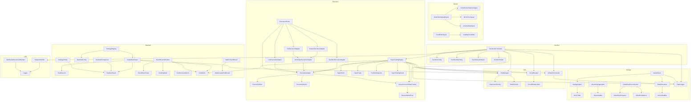

# Mermaid Diagram

```mermaid
flowchart TD
  subgraph Runtime
    RuntimeConfig["RuntimeConfig"]
    RuntimeOrchestrator["RuntimeOrchestrator"]
    RuntimeWatchdog["RuntimeWatchdog"]
    RuntimeCycleResult["RuntimeCycleResult"]
    RuntimeHealth["RuntimeHealth"]
  end

  subgraph Risk
    RiskControlConfig["RiskControlConfig"]
    RiskDecision["RiskDecision"]
    CircuitBreakerState["CircuitBreakerState"]
    CircuitBreaker["CircuitBreaker"]
    RiskManager["RiskManager"]
    KillSwitchController["KillSwitchController"]
  end

  subgraph Signals
    OrderBookImbalanceSignal["OrderBookImbalanceSignal"]
    MicroPriceSignal["MicroPriceSignal"]
    VolumeDeltaSignal["VolumeDeltaSignal"]
    OrderBookSignalEngine["OrderBookSignalEngine"]
    TrendFilterSignal["TrendFilterSignal"]
    VolatilityTrendFilter["VolatilityTrendFilter"]
  end

  subgraph Storage
    MarketStore["MarketStore"]
    BarAggregator["BarAggregator"]
    OHLCVBar["OHLCVBar"]
    StreamingAggregator["StreamingAggregator"]
    StreamingBar["StreamingBar"]
    OrderBookSnapshot["OrderBookSnapshot"]
    OrderBookMetrics["OrderBookMetrics"]
    OrderBookReconstructor["OrderBookReconstructor"]
    NormalizedBar["NormalizedBar"]
    DataNormalizer["DataNormalizer"]
    TradeLogger["TradeLogger"]
  end

  subgraph Execution
    ExecutionOrder["ExecutionOrder"]
    ExecutionReport["ExecutionReport"]
    ExecutionAdapter["ExecutionAdapter"]
    SandboxExecutionAdapter["SandboxExecutionAdapter"]
    ExchangeExecutionAdapter["ExchangeExecutionAdapter"]
    KrakenExecutionAdapter["KrakenExecutionAdapter"]
    FiriExecutionAdapter["FiriExecutionAdapter"]
    LiveExecutionAdapter["LiveExecutionAdapter"]
    ExecutionRouter["ExecutionRouter"]
    PaperOrder["PaperOrder"]
    PaperTrade["PaperTrade"]
    PortfolioSnapshot["PortfolioSnapshot"]
    PaperTradingResult["PaperTradingResult"]
    PaperTradingEngine["PaperTradingEngine"]
    ReconciliationEntry["ReconciliationEntry"]
    SessionAccountStateTracker["SessionAccountStateTracker"]
  end

  subgraph Backtest
    TradeRecord["TradeRecord"]
    BacktestResult["BacktestResult"]
    SimpleBacktester["SimpleBacktester"]
    BacktestConfig["BacktestConfig"]
    BacktestComparison["BacktestComparison"]
    StrategyRegistry["StrategyRegistry"]
    EventDrivenSimulator["EventDrivenSimulator"]
    EventDrivenTrade["EventDrivenTrade"]
    PendingOrder["PendingOrder"]
    PerformanceMetrics["PerformanceMetrics"]
    CostModel["CostModel"]
    StrategyPlotter["StrategyPlotter"]
    WalkForwardFoldResult["WalkForwardFoldResult"]
    WalkForwardResult["WalkForwardResult"]
  end

  subgraph Utils
    TelegramNotifier["TelegramNotifier"]
    WebSocketReconnectHandler["WebSocketReconnectHandler"]
    Logger["Logger"]
  end

  RuntimeOrchestrator --> RuntimeConfig
  RuntimeOrchestrator --> RuntimeWatchdog
  RuntimeOrchestrator --> RuntimeCycleResult
  RuntimeOrchestrator --> RuntimeHealth
  RuntimeOrchestrator --> PaperTradingEngine
  RuntimeOrchestrator --> TradeLogger
  RuntimeOrchestrator --> TelegramNotifier
  RuntimeOrchestrator --> CircuitBreaker
  RuntimeOrchestrator --> RiskManager
  RuntimeOrchestrator --> KillSwitchController
  RuntimeOrchestrator --> SessionAccountStateTracker

  PaperTradingEngine --> PaperOrder
  PaperTradingEngine --> PaperTrade
  PaperTradingEngine --> PortfolioSnapshot
  PaperTradingEngine --> PaperTradingResult
  PaperTradingEngine --> RiskManager
  PaperTradingEngine --> CircuitBreaker
  PaperTradingEngine --> KillSwitchController
  PaperTradingEngine --> CostModel
  PaperTradingEngine --> TradeLogger
  PaperTradingEngine --> ExecutionAdapter

  ExecutionAdapter --> ExecutionOrder
  ExecutionAdapter --> ExecutionReport
  SandboxExecutionAdapter --> ExecutionAdapter
  ExchangeExecutionAdapter --> ExecutionAdapter
  KrakenExecutionAdapter --> ExchangeExecutionAdapter
  FiriExecutionAdapter --> ExchangeExecutionAdapter
  LiveExecutionAdapter --> ExecutionAdapter
  ExecutionRouter --> ExecutionAdapter
  ExecutionRouter --> SandboxExecutionAdapter
  ExecutionRouter --> KrakenExecutionAdapter
  ExecutionRouter --> FiriExecutionAdapter
  ExecutionRouter --> LiveExecutionAdapter

  SessionAccountStateTracker --> ReconciliationEntry
  PaperTradingEngine --> SessionAccountStateTracker
  ExecutionAdapter --> SessionAccountStateTracker

  RiskManager --> RiskControlConfig
  RiskManager --> RiskDecision
  CircuitBreaker --> CircuitBreakerState
  KillSwitchController --> TradeLogger

  MarketStore --> BarAggregator
  MarketStore --> DataNormalizer
  MarketStore --> TradeLogger
  BarAggregator --> OHLCVBar
  StreamingAggregator --> StreamingBar
  OrderBookReconstructor --> OrderBookSnapshot
  OrderBookReconstructor --> OrderBookMetrics
  DataNormalizer --> NormalizedBar

  OrderBookSignalEngine --> OrderBookImbalanceSignal
  OrderBookSignalEngine --> MicroPriceSignal
  OrderBookSignalEngine --> VolumeDeltaSignal
  TrendFilterSignal --> VolatilityTrendFilter

  SimpleBacktester --> TradeRecord
  SimpleBacktester --> BacktestResult
  SimpleBacktester --> RiskManager
  SimpleBacktester --> CostModel
  StrategyRegistry --> SimpleBacktester
  StrategyRegistry --> BacktestConfig
  BacktestComparison --> BacktestResult
  EventDrivenSimulator --> EventDrivenTrade
  EventDrivenSimulator --> PendingOrder
  EventDrivenSimulator --> CostModel
  WalkForwardResult --> WalkForwardFoldResult
  StrategyPlotter --> BacktestResult

  TelegramNotifier --> Logger
  WebSocketReconnectHandler --> Logger
```
